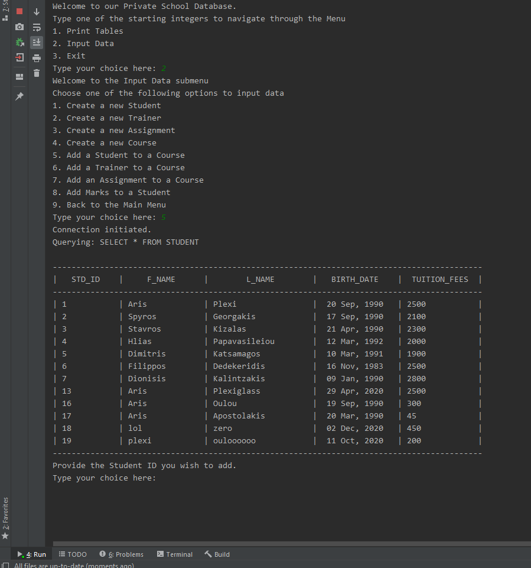
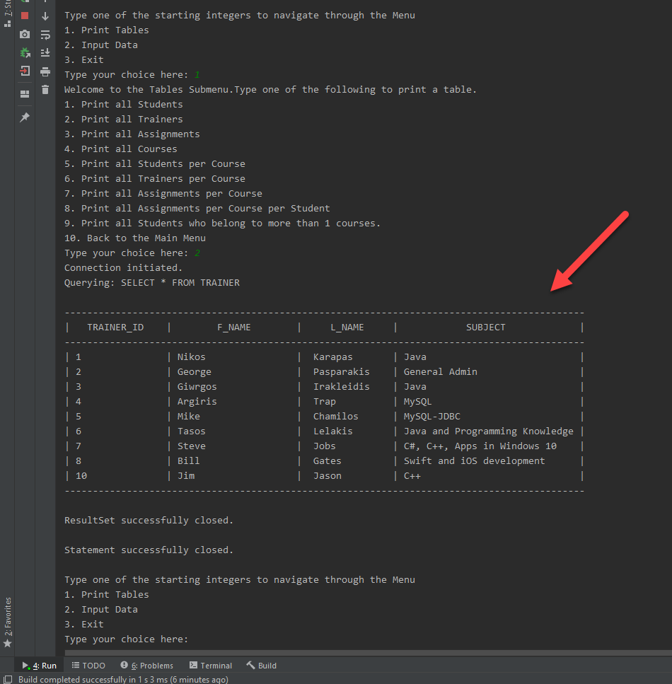
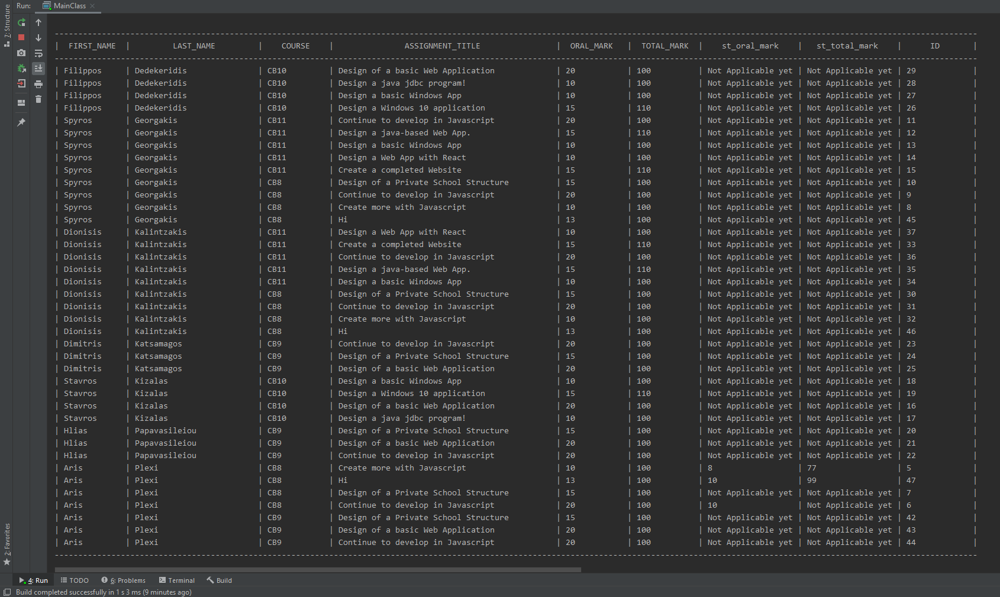

# JDBC Console App

Image shows the process of adding a **Student** to one of the **Courses**:

  

  

## Getting Started

Firstly, make sure to create the necessary table using the file in *~/SQL/Private_SchoolDB.sql*  
Credentials used in DB can be found in MyDBConnection.java class:  
*Username*: root  
*Password*: 1234

Then, proceed to run the app with your preferred IDE and navigate through the Menu.

## Caution

- Please add **Students** and **Assignments** to courses with caution (Insert menu options 5,7)
**Assignments** per **Course** per **Student** table (print Menu option 8) can grow fast.

A welcome contribution would be to print all **Assignments** per **Student** or per **Course** (Easy to implement,  simply alter the query String).
This would prevent us from printing too large tables with rows > 100.

## Private School Structure

The application simulates the structure of a *Private School* featuring:

Connection to the local Database that produces SQL Queries to output:
- A list of all the **Students**
- A list of all the **Trainers**
- A list of all the **Assignments**
- A list of all the **Courses**
- All **Students** per **Course**
- All **Trainers** per **Course**
- All **Assignments** per **Course**
- All **Assignments** per Course per **Student**
- A list of **Students** that belong to more than one **Course**

Enables the User to input Data to the following tables:

1. **Students**
2. **Trainers**
3. **Assignments**
4. **Courses**
5. **Students** per **Course**
6. **Trainers** per **Course**
7. **Assignments** per **Student** per **Course**

## Implementation

- All Tables are **Many-to-Many**.
- Assignments that are not yet graded, show the corresponding message: *NOT APPLICABLE YET*
- Validations for input values are included and being handled in Java.
- **Inheritance**: InsertData.Java & PrintCMD.java both **extend** ResultSets.java

## Features

1. Well formatted printing of the Tables (MYSQL cmd-like).
    * I used [Apache Commons Lang](https://commons.apache.org/proper/commons-lang/download_lang.cgi/) to achieve this. Here is a sample image:

    

	
2. Three different Menus for quick navigation.
	
3. Step by Step messages to the user (e.g. when adding a trainer to a course etc.)

4. Implicitly adds the corresponding **Assignments** when the User adds
	   a **Student** to a **Course**.

5. Prints 9 different tables to accommodate for all types of requests.

6. One of the most demanding features, was that each Student has his/her own Grades for each **Assignment** with the extra option of Graded/Not-Graded Assignments   
This is depicted here on the *Assignment per Course per Student* **Table**:

  

  

## Technology Stack

* [IntelliJ Ultimate Edition](https://www.jetbrains.com/idea/) - My preferred IDE
* [MySQL](https://www.mysql.com/)- Database used
* [Java 11](https://www.oracle.com/java/technologies/javase-jdk11-downloads.html) - Java version used
* [Java JDBC API](https://docs.oracle.com/javase/8/docs/technotes/guides/jdbc/) - API to connect with our DB

